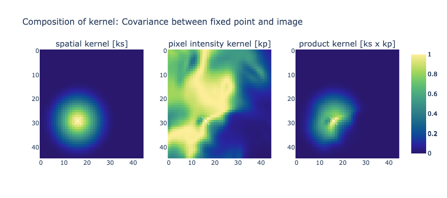

# Super-resolution

Data fusions of high-resolution gridded data with low-resolutions gridded data with the aim of transferring structural features to from high to low. 

## Table of Contents

- equations.mmd conatins equations used from paper

## Data
- Antarctic ice velocity - [MEaSUREs Phase-Based Antarctica Ice Velocity Map, Version 1,(NSIDC-0754)](https://nsidc.org/data/nsidc-0754/versions/1)
  - 450m resolution
  - [documentation](https://nsidc.org/sites/default/files/nsidc-0754-v001-userguide.pdf)
  - 6GB file download by running 'python nsidc-download_NSIDC-0754.001_2023-08-22.py'
  - ice velocity: speed and direction can be derived.
  - errors (noise) provided
  - strain model (see figure in supplement) for ice core placement
    - down-stream BO application

- Antarctic bed elevation - [MEaSUREs BedMachine Antarctica, Version 3, (NSIDC-0756)](https://nsidc.org/data/nsidc-0756/versions/3)
    - 500m resolution
    - [documentation](https://nsidc.org/sites/default/files/nsidc-0756-v002-userguide_1.pdf)
    - contains surface elevation, ice thickness, bed elevation (topography), firn air content
    - surface elevations data is from REMA (2015), ice thickness was modelled and bed elevation (topography) was inferred. Firn is a correction value that was applied to ice thickness.
    - errors provided
    - controlled experiment: upsample and evaluate reconstruction
    - The nominal year of this data set is 2015 — the year of the reference surface digital elevation model (REMA).
    - Note: Ice flow velocity derived from satellite interferometry (Rignot et al., 2011; Mouginot et al., 2017).

## Benchmarks
- Streamline diffusion is used in BedMachine for it's anisotropic qualities. 
- Bilinear interpolation (https://pytorch.org/docs/stable/generated/torch.nn.functional.grid_sample.html)
  - Nice blogpost: https://gist.github.com/peteflorence/a1da2c759ca1ac2b74af9a83f69ce20e 

## Metrics

- Mean Squared Error
- UIQ
- Peak Signal-to-Noise Ratio (PSNR)
  - Also used in DeepBedMap

## Notes (to myself)
- Which year to use:
- Use 2016 data since this is the latest common denominator
  - Change to 2015 potentially
- Booth datasets are provided on [WGS 84 / Antarctic Polar Stereographic EPSG:3031](https://epsg.io/3031)
- create a new complimentary modality
- Limitation paper: subdivision
- images were artificially downsampled by a range of magnification factors to construct a controlled testing scenario.
- Average pooling is the same as magnifying
- Visualise lr input, hr input, output
- Visualise kernel components
- Compare to setconv/density channels
- Extend to disjoint grids
- role of geophysical data e.g. altitude
- Use surface elevation to improve resolution of ice flow: measured in 2 directions
  - Physics informed kernel?
- Min-Max Normalisation: Per scence or across all (batch)
- Dataset for Dome C and for Transantarctic Mountains (Byrd and Mulock glaciers)
  - name based on upper right corner coordinates.
  - Conversion tool
    - Dome C: X 1359993 Y -894443
- Project units of error (MSE) back to original domain
  

High-res data sets can be considered auxiliary datasets: Use multiple aux. data streams (potentially on different resolutions) to refine the low-res. channel: 
- spatially varying "weightings" for refining. 

# References

[Reid, Alistair, Fabio Ramos, and Salah Sukkarieh. "Bayesian Fusion for Multi-Modal Aerial Images." Robotics: Science and Systems. 2013.](https://citeseerx.ist.psu.edu/document?repid=rep1&type=pdf&doi=89c7a83a8b9a99240c33b9d49d330755d071ae53)

# Data product and associated citations

## BedMachine
Morlighem, M. (2022). MEaSUREs BedMachine Antarctica, Version 3 [Data Set]. Boulder, Colorado USA. NASA National Snow and Ice Data Center Distributed Active Archive Center. https://doi.org/10.5067/FPSU0V1MWUB6. Date Accessed 08-16-2023. 

Morlighem, M., E. Rignot, T. Binder, D. D. Blankenship, R. Drews, G. Eagles, O. Eisen, F. Ferraccioli, R. Forsberg, P. Fretwell, V. Goel, J. S. Greenbaum, H. Gudmundsson, J. Guo, V. Helm, C. Hofstede, I. Howat, A. Humbert, W. Jokat, N. B. Karlsson, W. Lee, K. Matsuoka, R. Millan, J. Mouginot, J. Paden, F. Pattyn, J. L. Roberts, S. Rosier, A. Ruppel, H. Seroussi, E. C. Smith, D. Steinhage, B. Sun, M. R. van den Broeke, T. van Ommen, M. van Wessem, and D. A. Young. 2020. Deep glacial troughs and stabilizing ridges unveiled beneath the margins of the Antarctic ice sheet. Nature Geoscience. 13. DOI: 10.1038/s41561-019-0510-8.

## Ice Velocity

Mouginot, J., E. Rignot, and B. Scheuchl. (2019). MEaSUREs Phase-Based Antarctica Ice Velocity Map, Version 1 [Data Set]. Boulder, Colorado USA. NASA National Snow and Ice Data Center Distributed Active Archive Center. https://doi.org/10.5067/PZ3NJ5RXRH10. Date Accessed 08-21-2023.

Mouginot, J., E. Rignot, and B. Scheuchl. 2019. Continent-wide, interferometric SAR phase-mapping of Antarctic ice velocity. Geophysical Research Letters. 46. DOI: 10.1029/2019GL083826.

[AGU press release](https://news.agu.org/press-release/glaciologists-unveil-most-precise-map-ever-of-antarctic-ice-velocity/)

